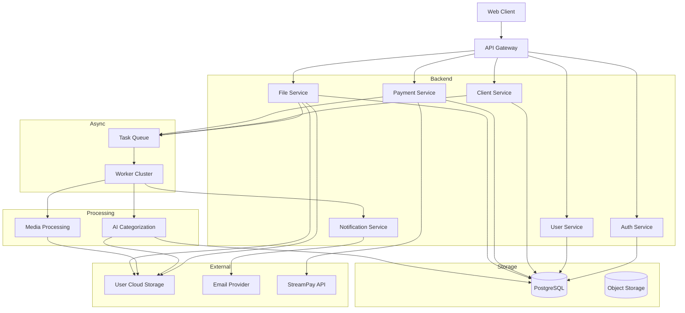

# Tasweeri Platform
### Description:
Tasweeri is a platform for photography studios, enthusiasts, and amateurs built to ease client relations and portfolio management.
### Core Idea:
Tasweeri will allow you to upload photos to the platform and store them, or allows you to connect your choice of cloud storage platform that you personally pay for and maintain. After connecting to the platform of choice, Tasweeri will give you the option of automatic photo and video categorization and organization through AI technology. In addition to automatic organization, Tasweeri also offers to be the mediator between you and the client. Enter your client's email, select a subset of photos that you would like to show the client before paying, and select the set of photos you want to unlock on payment. The client gets a 24 hour access window in their email to preview the selected subset. After expiry, the client has to pay to get access to any other content you selected for them. Upon payment, the client will be generated a ZATCA compliant invoice as well as a permanent access link with the option for them to copy over all files to their platform of choice through Tasweer.
## Features to be built in the web app

 1. Full featured file manager
 2. Self connected storage platform choice
 3. Subscriptions
	 - Storage Subscription
	 - Organizer Subscription
	 - Organizer & Storage Subscription
	 - Organizer & Client Management Subscription
	 - All in One Subscription 
4. Client Management
5. StreamPay API Integration
## System Architecture Overview

